# 进度记录

## 2022.9.8 

开始

# HDLBits

## Getting Started

### [Getting Started](https://hdlbits.01xz.net/wiki/step_one)

### [Output Zero](https://hdlbits.01xz.net/wiki/zero)

输出0；

```verilog
//HDLBits uses Verilog-2001 ANSI-style port declaration syntax because it's easier to read and reduces typos. You may use the older Verilog-1995 syntax if you wish. For example, the two module declarations below are acceptable and equivalent
module top_module(zero);// Module body starts after semicolon
    output zero;
	wire zero;
    always
    begin
    	zero=1'b0;
    end
endmodule

或者
module top_module(
    output zero
);// Module body starts after semicolon

    assign zero = 0;

endmodule
```

总结：

- 赋值语句：连续赋值（有assign），过程赋值（无assign）
- 过程赋值必须要在过程语句块中，过程语句块就两种：initial、always。连续赋值语句不能出现在过程快中（initial/always）


## Verilog Language

### Basics

#### [Simple wire](https://hdlbits.01xz.net/wiki/wire)

```verilog
module top_module(  in,  out );
    input in;
    output out;
    wire out;
    wire in;
    assign out =in;

endmodule

//或者

module top_module( input in, output out );
	
	assign out = in;
	// Note that wires are directional, so "assign in = out" is not equivalent.
	
endmodule

```

module top_module( input in, output out );	默认in和out是wire类型的。

#### [Four wires](https://hdlbits.01xz.net/wiki/wire4)

```verilog
module top_module( 
    input a,b,c,
    output w,x,y,z );
    assign w=a;
    assign x=b;
    assign y=b;
    assign z=c;

endmodule
```

#### [Inverter](https://hdlbits.01xz.net/wiki/notgate)

```verilog
module top_module( input in, output out );
    assign out =~in;

endmodule

```

Verilog中有两种取反，逻辑取反 ! 和按位取反 ~ ，前者只能用于一位的信号，即!1=0, !0=1，在电路中对应一个反相器；后者还可用于多位宽的信号，如~101=010。

#### [AND gate](https://hdlbits.01xz.net/wiki/andgate)

```verilog
module top_module( 
    input a, 
    input b, 
    output out );
    assign out = a&b;

endmodule
```


#### [NOR gate](https://hdlbits.01xz.net/wiki/norgate)

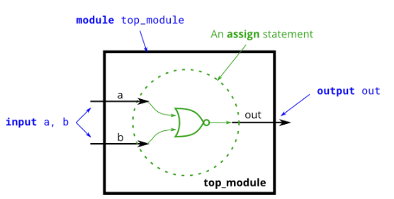

或非门

```verilog
module top_module( 
    input a, 
    input b, 
    output out );
    assign out=~(a|b);

endmodule
```

#### [XNOR gate](https://hdlbits.01xz.net/wiki/xnorgate)

```verilog
module top_module( 
    input a, 
    input b, 
    output out );
    assign out =~(a^b);

endmodule
```

#### [Declaring wires](https://hdlbits.01xz.net/wiki/wire_decl)

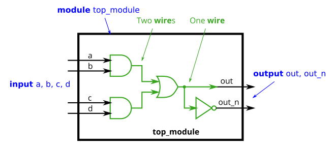

```verilog
module top_module(
    input a,
    input b,
    input c,
    input d,
    output out,
    output out_n   ); 
    
    wire leftUp;
    wire leftDown;
    assign leftUp=a&b;
	assign leftDown=c&d;
	assign out=leftDown|leftUp;
	assign out_n=!out;
	

endmodule
```

#### [7458 chip](https://hdlbits.01xz.net/wiki/7458)

```verilog
module top_module ( 
    input p1a, p1b, p1c, p1d, p1e, p1f,
    output p1y,
    input p2a, p2b, p2c, p2d,
    output p2y );

	assign p2y=(p2a&p2b)|(p2c&p2d);
	assign p1y=(p1a&p1b&p1c)|(p1d&p1e&p1f);

endmodule
```


### Vectors

Verilog中的向量通过定义一个名称将相关的**同类型信号进行分组**，使得它们更易被调用或操作。声明向量时，需将维数（向量由信号组成，所以也可称位宽）放在向量名之前，且一般以 **[n-1:0]** 的格式来声明**n**维（位）的向量，这与C语言的数组不同。在部分选择向量中的bit时，则将位宽放于向量名之后。

#### [Vectors](https://hdlbits.01xz.net/wiki/vector0)

```verilog
module Vector0( 
    input wire [2:0] vec,
    output wire [2:0] outv,
    output wire o2,
    output wire o1,
    output wire o0  ); // Module body starts after module declaration
	
	assign outv=vec;
	assign o2=vec[2];
	assign o1=vec[1];
	assign o0=vec[0];

endmodule
```


#### [Vectors in more detail](https://hdlbits.01xz.net/wiki/vector1)

```verilog
module Vector1(
    input wire [15:0] in,
    output wire [7:0] out_hi,
    output wire [7:0] out_lo );
	
	assign out_lo=in[7:0];
	assign out_hi=in[15:8];
endmodule
```


#### [Vector part select](https://hdlbits.01xz.net/wiki/vector2)

**Practice:** Build a circuit that will reverse the byte ordering of the word: 

AaaaaaaaBbbbbbbbCcccccccDddddddd → DdddddddCcccccccBbbbbbbbAaaaaaaa

```verilog
module Vector2(
    input [31:0] in,
    output [31:0] out );//
	
    assign out[31:24] = in[ 7: 0];
    assign out[23:16] = in[15: 8];
    assign out[15: 8] = in[23:16];
    assign out[ 7: 0] = in[31:24];
endmodule
```

当需要改变端序时，通常会使用此操作（比如 x86 体系按小端存储数据，而Internet协议中均使用大端，在两者间进行数据交换前，均要进行大小端转换）。大小端在上一节提到过，有兴趣的童鞋可以看计算机组成之类的书籍。

#### [Bitwise operators](https://hdlbits.01xz.net/wiki/vectorgates)

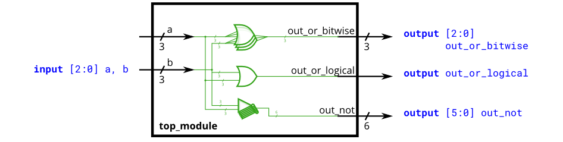

```
module Vectorgates(
    input [2:0] a,
    input [2:0] b,
    output [2:0] out_or_bitwise,
    output out_or_logical,
    output [5:0] out_not
    );
	
	assign	out_or_bitwise=a|b;
	assign	out_or_logical=a||b;
	assign	out_not=~{b,a};
endmodule

```

！ 逻辑反

~ 位反

#### [Four-input gates](https://hdlbits.01xz.net/wiki/gates4)

```verilog
module Gates4(
    input [3:0] in,
    output out_and,
    output out_or,
    output out_xor
    );
	
	assign out_and = & in;
	assign out_or  = | in;
	assign out_xor = ^ in;
endmodule
```

#### [Vector concatenation operator](https://hdlbits.01xz.net/wiki/vector3)

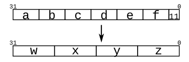

```verilog
module Vector3(
    input [4:0] a, b, c, d, e, f,
    output [7:0] w, x, y, z );//
	
	assign w={a,b[4:2]};
	assign x={b[1:0],c,d[4]};
	assign y={d[3:0],e[4:1]};
	assign z={e[0],f,2'b11};
endmodule

或者
module top_module (
    input [4:0] a, b, c, d, e, f,
    output [7:0] w, x, y, z );

    assign {w,x,y,z} = {a,b,c,d,e,f,2'b11};

endmodule
```


#### [Vector reversal 1](https://hdlbits.01xz.net/wiki/vectorr)

```
module Vectorr(
    input [7:0] in,
    output [7:0] out
    );
	assign out = {in[0],in[1],in[2],in[3],in[4],in[5],in[6],in[7]};
endmodule

```


#### [Replication operator](https://hdlbits.01xz.net/wiki/vector4)

```
module top_module (
    input [7:0] in,
    output [31:0] out );//

    // assign out = { replicate-sign-bit , the-input };
    assign out = {{24{in[7]}},in};
endmodule
```

{}复制功能时最外层的那个大括号{}是不能省略的！里外两层大括号是语法的必须要求！

#### [More replication](https://hdlbits.01xz.net/wiki/vector5)

```verilog
module top_module (
    input a, b, c, d, e,
    output [24:0] out );//
	assign out = ~{{5{a}},{5{b}},{5{c}},{5{d}},{5{e}}} ^ {5{a,b,c,d,e}};
    // The output is XNOR of two vectors created by 
    // concatenating and replicating the five inputs.
    // assign out = ~{ ... } ^ { ... };

endmodule
```


### Modules: Hierarchy

模块的**层次化结构**通过在一个模块中例化另一个模块来实现，只要这些模块都处于一个project（项目）中，编译器就

#### [Modules](https://hdlbits.01xz.net/wiki/module)

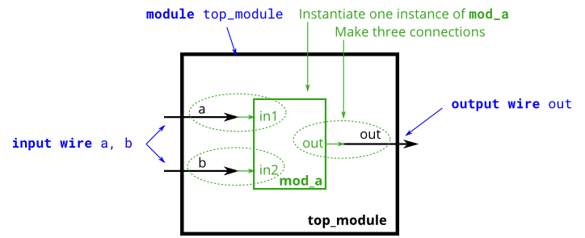

```verilog
module top_module ( input a, input b, output out );
 mod_a instance2 ( .in1(a), .in2(b), .out(out));
endmodule
```


#### [Connecting ports by position](https://hdlbits.01xz.net/wiki/module_pos)

#### [Connecting ports by name](https://hdlbits.01xz.net/wiki/module_name)

#### [Three modules](https://hdlbits.01xz.net/wiki/module_shift)

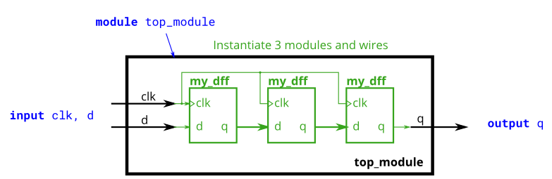

```verilog
module top_module ( input clk, input d, output q );
	wire q1;
    wire q2;

    my_dff Dff1(.clk(clk),
                .d(d),
                .q(q1));
    my_dff Dff2(.clk(clk),
                .d(q1),
                .q(q2));
    my_dff Dff3(.clk(clk),
                .d(q2),
                .q(q));
endmodule
```

#### [Modules and vectors](https://hdlbits.01xz.net/wiki/module_shift8)

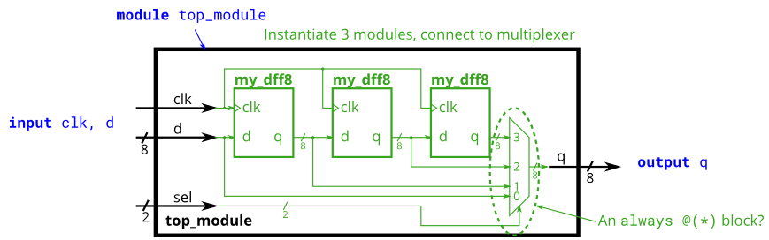

```verilog
module top_module ( 
    input clk, 
    input [7:0] d, 
    input [1:0] sel, 
    output [7:0] q 
);
    wire [7:0]q1,q2,q3;

    my_dff8 dff1( .clk(clk), .d(d), .q(q1));
    my_dff8 dff2( .clk(clk), .d(q1), .q(q2));
    my_dff8 dff3( .clk(clk), .d(q2), .q(q3));
    
    always@(*)
        case(sel)
            2'b00:q=d;
            2'b01:q=q1;
            2'b10:q=q2;
            2'b11:q=q3;
        endcase
endmodule
```


#### [Adder 1](https://hdlbits.01xz.net/wiki/module_add)

#### [Adder 2](https://hdlbits.01xz.net/wiki/module_fadd)

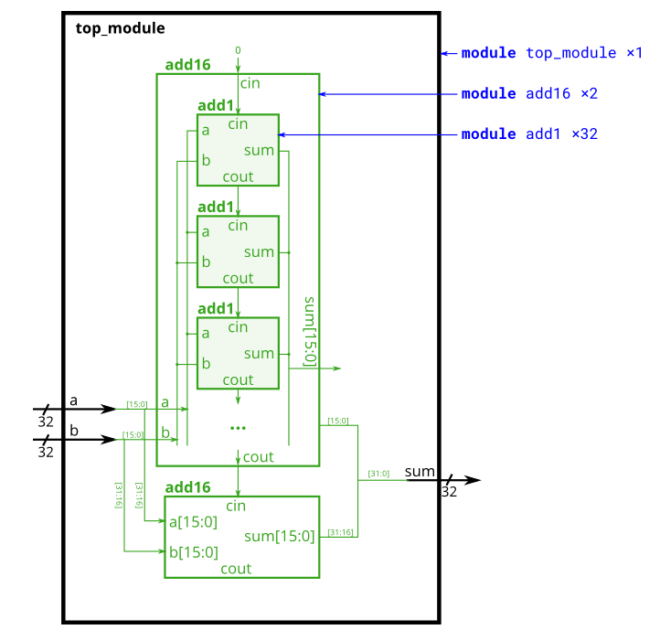

```verilog
module top_module (
    input [31:0] a,
    input [31:0] b,
    output [31:0] sum
);//
    wire add16_1_out;
    add16 add16_1(.cin(0),.a(a[15:0]),.b(b[15:0]),.cout(add16_1_out),.sum(sum[15:0]));
    add16 add16_2(.cin(add16_1_out),.a(a[31:16]),.b(b[31:16]),.sum(sum[31:16]));
endmodule

module add1 ( input a, input b, input cin,   output sum, output cout );
    assign sum=a^b^cin;
    assign cout=(a&b)|(a&cin)|(b&cin);

// Full adder module here

endmodule
```


#### [Carry-select adder](https://hdlbits.01xz.net/wiki/module_cseladd)

前两题实现的是**行波进位加法器**（也称**串行进位**或**逐位进位加法器**），这类加法器的缺点是较高位的相加结果必须等到低一位的进位产生之后才能开始计算，这使得加法器的计算延迟变大。**选择进位**是一种改进方法，如图所示，第一级加法器与之前相同，但第二级加法器有两个，一个假设进位为0，另一个假设进位为1，然后用2选1多路选择器来选择哪个是正确的。

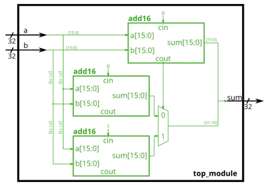

```verilog
module top_module(
    input [31:0] a,
    input [31:0] b,
    output [31:0] sum
);
	wire sel;
    wire [31:16]sum0, sum1;

    add16 add1 (.a(a[15:0]), .b(b[15:0]), .cin(1'b0), .sum(sum[15:0]), .cout(sel));
    add16 add21 (.a(a[31:16]), .b(b[31:16]), .cin(1'b0), .sum(sum0), .cout());
    add16 add22 (.a(a[31:16]), .b(b[31:16]), .cin(1'b1), .sum(sum1), .cout());

    assign sum[31:16] = sel?sum1:sum0;	//这是条件操作符，效果与case语句一样

endmodule
```


#### [Adder-subtractor](https://hdlbits.01xz.net/wiki/module_addsub)

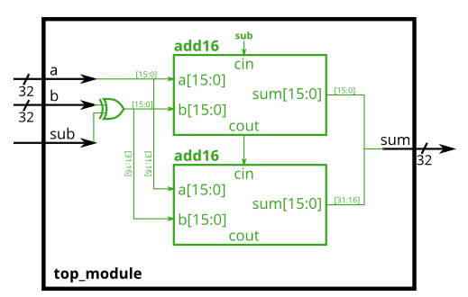

- 一个数取反（包括符号位）再加1就是在求它的相反数，即 a - b = a + (-b) = a + (~b + 1)，要注意的是，这是补码运算，而不是原码。
- 一个二进制数与0异或就是它本身，与1异或就是取反，将b与sub异或，并将sub连到进位上，这样就实现了通过sub来控制是否对b取反以及加1。

```verilog
module top_module(
    input [31:0] a,
    input [31:0] b,
    input sub,
    output [31:0] sum
);
    wire [31:0] subXorB;
    wire add16FstCout;
    assign subXorB = b^{32{sub}};
    add16 add16Fst(.cin(sub),.a(a[15:0]),.b(subXorB[15:0]),.sum(sum[15:0]),.cout(add16FstCout));
    add16 add16Sec(.cin(add16FstCout),.a(a[31:16]),.b(subXorB[31:16]),.sum(sum[31:16]));
endmodule
```


### Procedures

Procedures include **always**, initial, task, and function blocks. Procedures allow sequential statements (which cannot be used outside of a procedure) to be used to describe the behaviour of a circuit.

#### [Always blocks (combinational)](https://hdlbits.01xz.net/wiki/alwaysblock1)

**对于组合always块，敏感列表总是使用(\*)。**因为明确地列出信号容易出错（比如漏掉一个），并且这类错误在硬件综合时会被忽略：如果你明确地列出了敏感列表但漏了一个信号，综合出来的硬件电路仍与使用(*)时一样。但在仿真时，仿真器会按漏了一个信号的情况跑仿真，这会导致仿真结果与原硬件不匹配。（在SystemVerilog中，使用always_comb。）

```verilog
module top_module(
    input a, 
    input b,
    output wire out_assign,
    output reg out_alwaysblock
);
    assign out_assign=a&b;
    always@(*) out_alwaysblock=a&b;

endmodule
```

虽然always等过程块提供了一种高效描述电路的方式，但是这种方式也有缺点。比如你用if-else和for循环嵌套写了一个复杂的电路，后面实际综合出来的电路结构可能会让你很惊(beng)讶(kui)。这就是用高级语法进行行为级描述的缺陷，它让你很难把控电路结构的细节，全靠EDA工具去综合，而assign和逻辑门等“低级”描述方式就能有效避免这个缺陷。另外，还有软硬件编程思维之类的差别就不细说了，总之对于初学者来说，要记住一点，for循环之类的要慎用（循环虽好，可不要贪杯噢🤭）。

#### [Always blocks (clocked)](https://hdlbits.01xz.net/wiki/alwaysblock2)

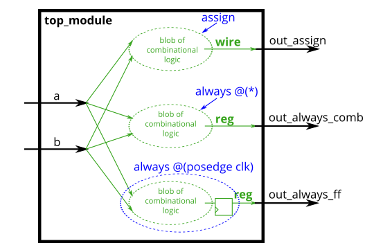

```verilog
module Alwaysblock2(
    input clk,
    input a,
    input b,
    output wire out_assign,
    output reg out_always_comb,
    output reg out_always_ff ,
	output reg out_always_ffNoZu 
    );
	
	always@(posedge clk)
		out_always_ff<=a^b;
	always@(posedge clk)
		out_always_ffNoZu=a^b;		
	always@(*)
		out_always_comb=a^b;
	assign out_assign=a^b;

endmodule
```

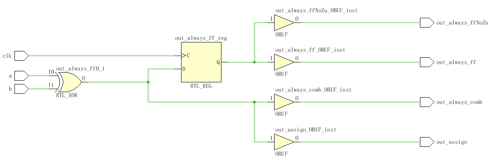

几种方式的比较，使用上升沿后，会引入寄存器。阻塞非阻塞都是一样的综合结果。

#### [If statement](https://hdlbits.01xz.net/wiki/always_if)

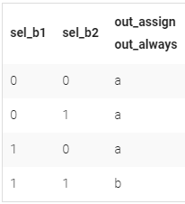


```verilog
// synthesis verilog_input_version verilog_2001
module top_module(
    input a,
    input b,
    input sel_b1,
    input sel_b2,
    output wire out_assign,
    output reg out_always   ); 
    
    assign out_assign=(sel_b1&sel_b2)? b:a;
    always@(*)
        begin
        if (sel_b1&sel_b2) begin
            out_always = b;
        end
        else begin
            out_always=a;
        end
        end
endmodule
```

#### [If statement latches](https://hdlbits.01xz.net/wiki/always_if2)

```verilog
module top_module (
	input      cpu_overheated,
	output reg shut_off_computer,
	input      arrived,
	input      gas_tank_empty,
	output reg keep_driving
);
	always @(*) begin
		if (cpu_overheated)
			shut_off_computer = 1;
		else
			shut_off_computer = 0;
	end

	always @(*) begin
		if (~arrived)
			keep_driving = ~gas_tank_empty;
		else
			keep_driving = ~arrived;
	end

endmodule
```

#### [Case statement](https://hdlbits.01xz.net/wiki/always_case)

写一个6-to-1的数据选择器，根据选择信号sel的值来选择相对应的数据输入，否则输出0。

```verilog
module top_module ( 
    input [2:0] sel, 
    input [3:0] data0,
    input [3:0] data1,
    input [3:0] data2,
    input [3:0] data3,
    input [3:0] data4,
    input [3:0] data5,
    output reg [3:0] out   );//

    always@(*) begin  // This is a combinational circuit
        case(sel)
            3'b000:out=data0;
            3'b001:out=data1;
            3'b010:out=data2;
            3'b011:out=data3;
            3'b100:out=data4;
            3'b101:out=data5;
            default out=4'b0000;
        endcase
    end

endmodule

//case中换成下面的也是可以的
            3'd0: out = data0;
            3'd1: out = data1;
            3'd2: out = data2;
            3'd3: out = data3;
            3'd4: out = data4;
            3'd5: out = data5;
```


#### [Priority encoder](https://hdlbits.01xz.net/wiki/always_case2)

优先编码器是一种组合电路，当给定一个输入位向量时，输出该向量从右往左数（从低位到高位）第一个1的位置。例如，输入8'b100**1**0000时，8位优先级编码器将输出3'd4，因为位[4]是从低到高第一个为1的位。（注：从右到左，最低的那位是第0位。）

```verilog
module top_module (
	input [3:0] in,
	output reg [1:0] pos
);
	always@(*) begin
		case(in)	// 用十六进制可以少打一些字，用二进制更直观，各有优劣
			4'b0000: pos = 2'b00;
			4'b0001: pos = 2'b00;
			4'b0010: pos = 2'b01;
			4'b0011: pos = 2'b00;
			4'b0100: pos = 2'b10;
			4'b0101: pos = 2'b00;
			4'b0110: pos = 2'b01;
			4'b0111: pos = 2'b00;
			4'b1000: pos = 2'b11;
			4'b1001: pos = 2'b00;
			4'b1010: pos = 2'b01;
			4'b1011: pos = 2'b00;
			4'b1100: pos = 2'b10;
			4'b1101: pos = 2'b00;
			4'b1110: pos = 2'b01;
			4'b1111: pos = 2'b00;
			default: pos = 2'b00;	// 这个例子中，16种情况都遍历了，此项可省略
		endcase
	end
endmodule


```


#### [Priority encoder with casez](https://hdlbits.01xz.net/wiki/always_casez)

如果按上一题的方式来写一个8位输入的优先编码器的话，case语句中将有256个case项。如果case语句中的case项与某些输入无关，就可以减少列出的case项（在本题中减少到9个）。这就是casez的用途：它在比较中将具有值z的位视为无关项。具体可参考下面对上一题的casez写法：

```verilog
module top_module (
    input [7:0] in,
    output reg [2:0] pos );
    always@(*) begin
        casez(in)
            8'bzzzz_zzz1:pos=3'b000;
            8'bzzzz_zz1z:pos=3'b001;
            8'bzzzz_z1zz:pos=3'b010;
            8'bzzzz_1zzz:pos=3'b011;
            8'bzzz1_zzzz:pos=3'b100;
            8'bzz1z_zzzz:pos=3'b101;
            8'bz1zz_zzzz:pos=3'b110;
            8'b1zzz_zzzz:pos=3'b111;
            default pos=3'b000;
        endcase
    end
endmodule
```

**casez是有优先级的**！比如在上面的例子中，4'b1111能匹配4'bzzz1、4'bzz1z、4'bz1zz、4'b1zzz四项中的任一项，但是为什么最终out输出0，因为4'bzzz1写在最前面（第一个case项），所以它的优先级最高，4'b1111按out=0输出。如果把四个case项改写成4'bzzz1、4'bzz10、4'bz100、4'b1000，那4'b1111只能匹配4'bzzz1，所以不管把4'bzzz1放第几个，4'b1111都会按4'bzzz1这一项的out=0来输出。

#### [Avoiding latches](https://hdlbits.01xz.net/wiki/always_nolatches)

为避免生成不必要的锁存器，必须在所有可能的情况下为所有的输出赋值（参见31.If statement latches）。这可能涉及许多不必要的输入，会多打很多字。 **一个简单的解决方法是在case语句之前为输出赋一个“默认值”**：

```verilog
always @(*) begin
    up = 1'b0; down = 1'b0; left = 1'b0; right = 1'b0;
    case (scancode)
        ... // Set to 1 as necessary.
    endcase
end
```

```verilog
module top_module (
    input [15:0] scancode,
    output reg left,
    output reg down,
    output reg right,
    output reg up  );

    always @(*) begin
        left=1'b0; down=1'b0; right=1'b0; up=1'b0;
        case(scancode)
            16'he06b: left = 1'b1;
            16'he072: down = 1'b1;
            16'he074: right = 1'b1;
            16'he075: up = 1'b1;
        endcase
    end

endmodule
```


### More Verilog Features

- [Conditional ternary operator](https://hdlbits.01xz.net/wiki/conditional)
- [Reduction operators](https://hdlbits.01xz.net/wiki/reduction)
- [Reduction: Even wider gates](https://hdlbits.01xz.net/wiki/gates100)
- [Combinational for-loop: Vector reversal 2](https://hdlbits.01xz.net/wiki/vector100r)
- [Combinational for-loop: 255-bit population count](https://hdlbits.01xz.net/wiki/popcount255)
- [Generate for-loop: 100-bit binary adder 2](https://hdlbits.01xz.net/wiki/adder100i)

```verilog
module top_module( 
    input [99:0] a, b,
    input cin,
    output [99:0] cout,
    output [99:0] sum );
	genvar i;
    generate
        for(i=0;i<100;i++) begin:adder //adder是循环生成语句的名
            if(i==0)
                assign{cout[0],sum[0]}=a[0]+b[0]+cin;
            else
                assign{cout[i],sum[i]}=a[i]+b[i]+cout[i-1];
        end           
    endgenerate
endmodule

```

for循环，如果循环范围是常量，可综合。数组可综合。 但浮点类型不可综合。乘除法，特别是除法一般也不推荐使用，即使可综合，逻辑级数也是非常大的。 如果把上面的代码放在一拍之内完成，恐怕得到频率会非常低。

https://bbs.eetop.cn/thread-597259-1-1.html

- [Generate for-loop: 100-digit BCD adder](https://hdlbits.01xz.net/wiki/bcdadd100)

## Circuits

### Combinational Logic

#### Basic Gates

- [Wire](https://hdlbits.01xz.net/wiki/exams/m2014_q4h)
- [GND](https://hdlbits.01xz.net/wiki/exams/m2014_q4i)
- [NOR](https://hdlbits.01xz.net/wiki/exams/m2014_q4e)
- [Another gate](https://hdlbits.01xz.net/wiki/exams/m2014_q4f)
- [Two gates](https://hdlbits.01xz.net/wiki/exams/m2014_q4g)
- [More logic gates](https://hdlbits.01xz.net/wiki/gates)
- [7420 chip](https://hdlbits.01xz.net/wiki/7420)
- [Truth tables](https://hdlbits.01xz.net/wiki/truthtable1)

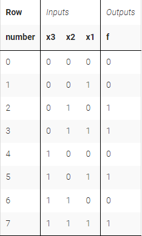

真值表的写法之一，使用乘积或

```verilog
module top_module( 
    input x3,
    input x2,
    input x1,  // three inputs
    output f   // one output
);
    assign f= ((~x3)&x2&(~x1))|((~x3)&x2&x1)|(x3&(~x2)&x1)|(x3&x2&x1);
endmodule
```

- [Two-bit equality](https://hdlbits.01xz.net/wiki/mt2015_eq2)
- [Simple circuit A](https://hdlbits.01xz.net/wiki/mt2015_q4a)
- [Simple circuit B](https://hdlbits.01xz.net/wiki/mt2015_q4b)
- [Combine circuits A and B](https://hdlbits.01xz.net/wiki/mt2015_q4)
- [Ring or vibrate?](https://hdlbits.01xz.net/wiki/ringer)

设计一种电路来控制手机的铃声和振动马达。当有来电输入信号时(input ring)，电路必须打开铃声(output ringer= 1)或电机(output motor= 1)，但不能同时打开。如果手机处于振动模式(input vibrate_mode = 1)，打开电机。否则打开铃声。

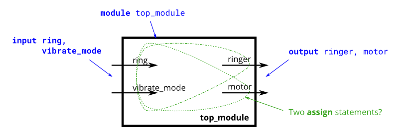

```verilog
module top_module (
    input ring,
    input vibrate_mode,
    output ringer,       // Make sound
    output motor         // Vibrate
);
    assign ringer = (!vibrate_mode)&ring;
    assign motor = (vibrate_mode)&ring;
endmodule

```

- [Thermostat](https://hdlbits.01xz.net/wiki/thermostat)
- [3-bit population count](https://hdlbits.01xz.net/wiki/popcount3)

数一下输入变量中有几个一

```verilog
module Popcount3(
    input [2:0] in,
    output reg [1:0] out_for,
	output [1:0] out_assign	
    );
	
	assign out_assign=in[0]+in[1]+in[2];
	
	integer i;
	always@(*) begin
		out_for = 2'b0;
		for(i=0;i<3;i=i+1) begin
			out_for = 	out_for+in[i];
		end
	end
endmodule
```

试了下，在这个代码中assign和for循环的RTL图是一致的。

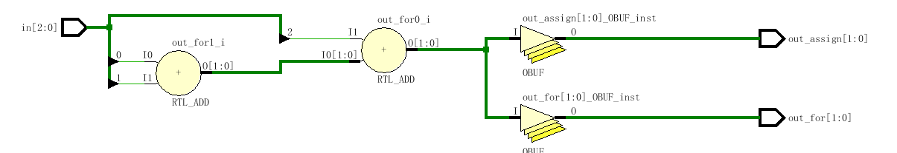

- [Gates and vectors](https://hdlbits.01xz.net/wiki/gatesv)

```verilog
//solution 1
module top_module( 
    input [3:0] in,
    output [2:0] out_both,
    output [3:1] out_any,
    output [3:0] out_different );

    assign out_both = {&in[3:2],&in[2:1],&in[1:0]};
    assign out_any = {|in[3:2],|in[2:1],|in[1:0]};
    assign out_different = {in[0]^in[3],^in[3:2],^in[2:1],^in[1:0]};
    
endmodule

//solution 2
module top_module (
	input [3:0] in,
	output [2:0] out_both,
	output [3:1] out_any,
	output [3:0] out_different
);

	// Use bitwise operators and part-select to do the entire calculation in one line of code
	// in[3:1] is this vector:   					 in[3]  in[2]  in[1]
	// in[2:0] is this vector:   					 in[2]  in[1]  in[0]
	// Bitwise-OR produces a 3 bit vector.			   |      |      |
	// Assign this 3-bit result to out_any[3:1]:	o_a[3] o_a[2] o_a[1]

	// Thus, each output bit is the OR of the input bit and its neighbour to the right:
	// e.g., out_any[1] = in[1] | in[0];	
	// Notice how this works even for long vectors.
	assign out_any = in[3:1] | in[2:0];

	assign out_both = in[2:0] & in[3:1];
	
	// XOR 'in' with a vector that is 'in' rotated to the right by 1 position: {in[0], in[3:1]}
	// The rotation is accomplished by using part selects[] and the concatenation operator{}.
	assign out_different = in ^ {in[0], in[3:1]};
	
endmodule
```

或者for循环

```verilog
module Gatesv(
    input [3:0] in,
    output [2:0] out_both,
    output [3:1] out_any,
    output [3:0] out_different,
	output reg [2:0] out_both_for,
    output reg [3:1] out_any_for,
    output reg [3:0] out_different_for
    );
	
    //assign out_both={in[3]&in[2],in[2]&in[1],in[1]&in[0]}; //使用上面的代码规约和这个是不一样的，规约有专门的RTL集成。
	//assign out_any={in[3]|in[2],in[2]|in[1],in[1]|in[0]};
	//assign out_different={in[3]^in[0],in[2]^in[3],in[1]^in[2],in[0]^in[1]};
	
    
	integer i;
    always @(*) begin
        for(i=0;i<3;i=i+1) begin
            out_both_for[i] = in[i] & in[i+1];
            out_any_for[i+1] = in[i+1] | in[i];
            out_different_for[i] = in[i] ^ in[i+1];
        end
        out_different_for[3] = in[0] ^ in[3];
    end
    

endmodule
```

综合出来是一样的

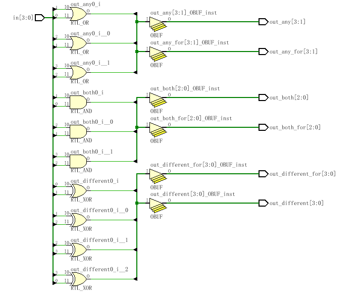


- [Even longer vectors](https://hdlbits.01xz.net/wiki/gatesv100)

当位数很多时，直接从1-99一个一个赋值就很慢了。

但是也不是必须要用for，如下面的方式就是一种可选的替换方法。

**规律：涉及到错位运算就要考虑到一次性多位错位赋值。**

```verilog
module top_module( 
    input [99:0] in,
    output [98:0] out_both,
    output [99:1] out_any,
    output [99:0] out_different );

    assign out_any = in[99:1] | in[98:0];
    assign out_both = in[98:0] & in[99:1];
    assign out_different = in ^ {in[0], in[99:1]};
    
endmodule
```

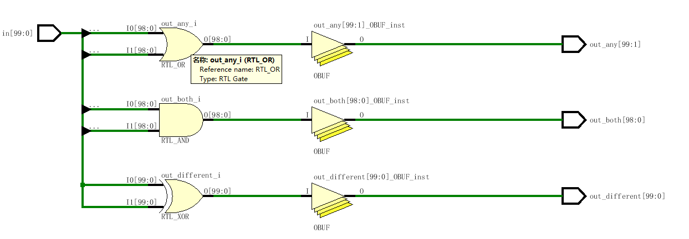


#### Multiplexers

- [2-to-1 multiplexer](https://hdlbits.01xz.net/wiki/mux2to1)
- [2-to-1 bus multiplexer](https://hdlbits.01xz.net/wiki/mux2to1v)
- [9-to-1 multiplexer](https://hdlbits.01xz.net/wiki/mux9to1v)

Create a 16-bit wide, 9-to-1 multiplexer. sel=0 chooses a, sel=1 chooses b, etc. For the unused cases (sel=9 to 15), set all output bits to '1'.

```verilog
module Mux9to1v(
    input [15:0] a, b, c, d, e, f, g, h, i,
    input [3:0] sel,
    output reg [15:0] out
    );
	
	always@(*) begin
		case(sel) 
            4'd0: out = a;//用十进制，4个比特数不变
            4'd1: out = b;
            4'd2: out = c;
            4'd3: out = d;
            4'd4: out = e;
            4'd5: out = f;
            4'd6: out = g;
            4'd7: out = h;
            4'd8: out = i;
			default:out=16'b1111_1111_1111_1111;
		endcase
	end
	
	
	
endmodule
```

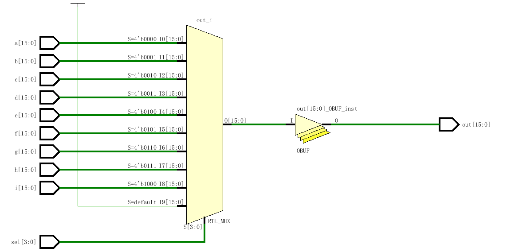


- [256-to-1 multiplexer](https://hdlbits.01xz.net/wiki/mux256to1)

Create a 1-bit wide, 256-to-1 multiplexer. The 256 inputs are all packed into a single 256-bit input vector. sel=0 should select `in[0]`, sel=1 selects bits `in[1]`, sel=2 selects bits `in[2]`, etc.

```verilog
module Mux256to1(
    input [255:0] in,
    input [7:0] sel,
    output out
    );
	
	assign out = in[sel];
endmodule
```

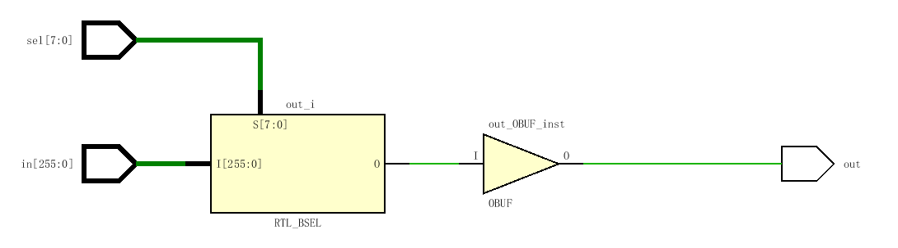

for循环中使用变量综合会出问题，但是在其他语句中使用变量应该没问题？留个心眼

- [256-to-1 4-bit multiplexer](https://hdlbits.01xz.net/wiki/mux256to1v)

创建 4 位宽、256 比 1 多路复用器。256 个 4 位输入全部打包到单个 1024 位输入矢量中。sel=0 应该选择[3：0]中的位，sel=1 选择[7：4]中的位，sel=2 选择[11：8] 中的位

大白话：四个四个取，0123，4567，891011这样子

```verilog
module top_module (
	input [1023:0] in,
	input [7:0] sel,
	output [3:0] out
);

	assign out = {in[sel*4+3], in[sel*4+2], in[sel*4+1], in[sel*4+0]};//combine all bits

endmodule
```


#### Arithmetic Circuits

- [Half adder](https://hdlbits.01xz.net/wiki/hadd)

半加器，可以用真值表写，也可以描述逻辑。

注意连接运算符的使用。

```verilog
module Hadd(
    input a, b,
    output cout, sum
    );
	
	assign {cout,sum}= a+b;
endmodule

//真值表
module top_module( 
    input a, b,
    output cout, sum 
);
    assign cout = a & b;
    assign sum = a ^ b;
endmodule

```

使用逻辑描述的RTL电路如下图：

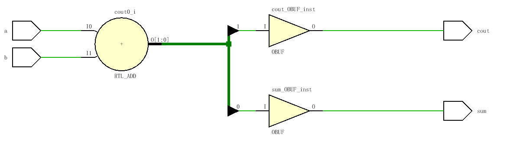


- [Full adder](https://hdlbits.01xz.net/wiki/fadd)

全加器

```verilog
module top_module( 
    input a, b, cin,
    output cout, sum );

    assign {cout,sum} = a + b + cin;
    
endmodule

//真值表
module top_module( 
    input a, b, cin,
    output cout, sum 
);
    assign cout = ((~a)&b&cin) | ((~b)&a&cin)|((~cin)&b&a)|(a&b&cin);
    assign sum = ((~a)&(~b)&cin)  | ((~a)&b&(~cin)) | ((~b)&a&(~cin))|(b&a&cin);

endmodule

```


- [3-bit binary adder](https://hdlbits.01xz.net/wiki/adder3)

Now that you know how to build a [full adder](https://hdlbits.01xz.net/wiki/Fadd), make 3 instances of it to create a 3-bit binary ripple-carry adder. The adder adds two 3-bit numbers and a carry-in to produce a 3-bit sum and carry out. To encourage you to actually instantiate full adders, also output the carry-out from *each* full adder in the ripple-carry adder. cout[2] is the final carry-out from the last full adder, and is the carry-out you usually see.

行波进位加法器：每个全加器的输出进位cout作为下一个全加器的输入进位cin

~~~verilog
module Adder3(
    input [2:0] a, b,
    input cin,
    output [2:0] cout,
    output [2:0] sum
    );
	
	assign {cout[0],sum[0]} = a[0] + b[0] +cin;
    assign {cout[1],sum[1]} = a[1] + b[1] +cout[0];
    assign {cout[2],sum[2]} = a[2] + b[2] +cout[1];
endmodule


//或者层次化
```verilog
module top_module( 
    input [2:0] a, b,
    input cin,
    output [2:0] cout,
    output [2:0] sum );

    full_adder adder1(a[0],b[0],cin,cout[0],sum[0]);
    full_adder adder2(a[1],b[1],cout[0],cout[1],sum[1]);
    full_adder adder3(a[2],b[2],cout[1],cout[2],sum[2]);
    
endmodule

//submodule
module full_adder(
    input a, b, cin,
    output cout, sum );

    assign {cout,sum} = a + b + cin;
    
endmodule
```
~~~

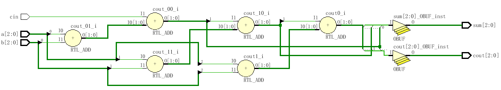

- [Adder](https://hdlbits.01xz.net/wiki/exams/m2014_q4j)
- [Signed addition overflow](https://hdlbits.01xz.net/wiki/exams/ece241_2014_q1c)

假设您有两个 8 位 2 的补码数，a[7：0] 和 b[7：0]。这些数字相加以产生s[7：0]。还要计算是否发生了溢出。

如何判断计算是否溢出：

当两个正数相加产生一个负结果，或两个负数相加产生一个正结果时，会发生符号溢出现象。

因此可以通过比较输入和输出数字的符号来计算溢出，如果输入和输出数字的符号相反，则溢出。

总结：除了上面的分析，这题要是先画波形图就有思路处理溢出的情况了。

```verilog
module ece241_2014_q1c(
    input [7:0] a,
    input [7:0] b,
    output [7:0] s,
    output overflow
    );

	assign s=a+b;
	assign overflow = (a[7]&b[7]&(~s[7])) | ((~a[7])&(~b[7])&(s[7]));
endmodule
```

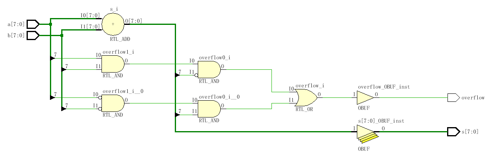

- [100-bit binary adder](https://hdlbits.01xz.net/wiki/adder100)
- [4-digit BCD adder](https://hdlbits.01xz.net/wiki/bcdadd4)

#### Karnaugh Map to Circuit

- [3-variable](https://hdlbits.01xz.net/wiki/kmap1)
- [4-variable](https://hdlbits.01xz.net/wiki/kmap2)

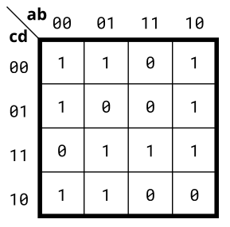

```verilog
module top_module(
    input a,
    input b,
    input c,
    input d,
    output out  ); 

    // assign out = ~a&~d | ~b&~c | ~a&b&c | a&c&d ; // sum-of-products
    assign out = (~a|~b|c) & (~b|c|~d) & (~a|~c|d) & (a|b|~c|~d); // product-of-sums
    
endmodule
```

- [4-variable](https://hdlbits.01xz.net/wiki/kmap3)

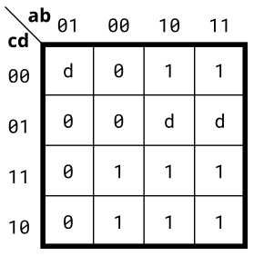

d是无关项，可以是0也可以是1

```verilog
module top_module(
    input a,
    input b,
    input c,
    input d,
    output out  ); 

    assign out = a | ~b&c ; // sum-of-products
    // assign out = (a|~b) & (a|c) ; //product-of-sums
    
endmodule
```


- [4-variable](https://hdlbits.01xz.net/wiki/kmap4)
- [Minimum SOP and POS](https://hdlbits.01xz.net/wiki/exams/ece241_2013_q2)

具有四个输入（a、b、c、d）的单输出数字系统在输入为2、7或15时输出1，在输入0、1、4、5、6、9、10、13或14时输出0。输入3、8、11和12为不可能的输入。例如，输入7则输出a、b、c、d对应为0,1,1,1的。

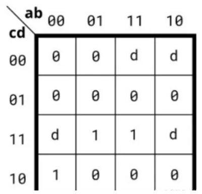

对于不可能的输入，可以处理为d。遇到画过圈的包含d的1时，一定输出1；

```verilog
module top_module (
    input a,
    input b,
    input c,
    input d,
    output out_sop,
    output out_pos
);
    assign out_pos = (~a & ~b & c) | (b & c & d) | (a & c & d);
	assign out_sop = c & (~a | d) & (~b | d);
endmodule
```

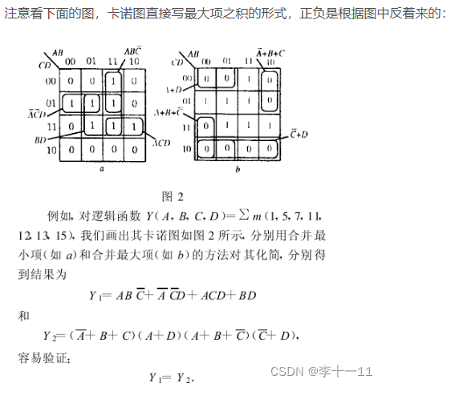


- [Karnaugh map](https://hdlbits.01xz.net/wiki/exams/m2014_q3)
- [Karnaugh map](https://hdlbits.01xz.net/wiki/exams/2012_q1g)

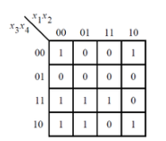

```verilog
module top_module (
    input [4:1] x,
    output f
); 
    assign f=(x[2]&x[3]&x[4])|((!x[2])&(!x[4]))|(x[3]&(!x[1]));
endmodule
```

- [K-map implemented with a multiplexer](https://hdlbits.01xz.net/wiki/exams/ece241_2014_q3)

### Sequential Logic

#### Latches and Flip-Flops

- [D flip-flop](https://hdlbits.01xz.net/wiki/dff)

D触发器

```verilog
module Dff(
    input clk,    // Clocks are used in sequential circuits
    input d,
    output reg q 
    );
	
	always@(posedge clk) begin
		q=d;
	end
	
	
endmodule
```

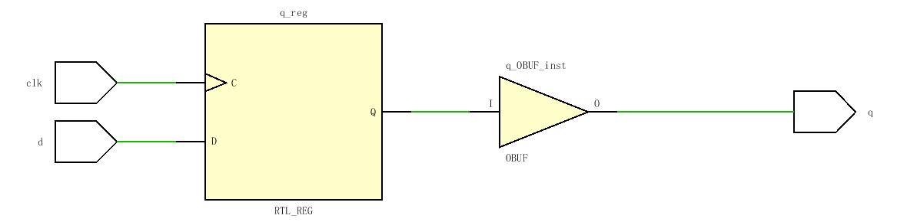

- [D flip-flops](https://hdlbits.01xz.net/wiki/dff8)
- [DFF with reset](https://hdlbits.01xz.net/wiki/dff8r)

有对应的resetD触发器的

```verilog
module Dff8r(
    input clk,
    input reset,            // Synchronous reset
    input [7:0] d,
    output reg [7:0] q
    );
	
	always@(posedge clk) begin
		if(reset) begin
			q<=8'd0;
		end
		else begin
			q<=d;
		end
		
	end
	
endmodule

```

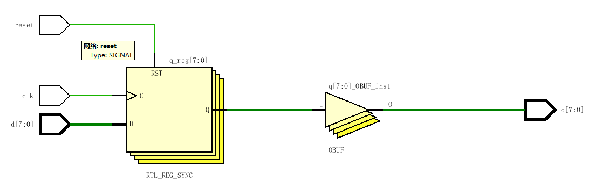

- [DFF with reset value](https://hdlbits.01xz.net/wiki/dff8p)
- [DFF with asynchronous reset](https://hdlbits.01xz.net/wiki/dff8ar)
- [DFF with byte enable](https://hdlbits.01xz.net/wiki/dff16e)

创建一个16D触发器，其中字节使能信号byteena控制当前时钟周期中16个寄存器中哪个字节需被修改。byteena[1]控制高字节d[15:8]，而byteena[0]控制低字节d[7:0]。

resetn是一个**同步，低复位**信号。

所有的D触发器由clk的**上升沿触发**

```verilog
module top_module (
    input clk,
    input resetn,
    input [1:0] byteena,
    input [15:0] d,
    output [15:0] q
);
	always@(posedge clk) begin
		if(resetn==1'b0) begin
			q<=16'd0;
		end
		else begin
			if(byteena[0]==1'b1) begin
				q[7:0]<=d[7:0];
			end
			else begin
				q[7:0]<=q[7:0];
			end
			if(byteena[1]==1'b1) begin
				q[15:8]<=d[15:8];
			end
			else begin
                q[15:8]<=q[15:8];
			end
			
		end
		
	end
endmodule

//或者省略else也可
//组合逻辑中存在latch所以不能省略但是在时序逻辑中存在latch可能是功能所需的。
module top_module (
    input clk,
    input resetn,
    input [1:0] byteena,
    input [15:0] d,
    output [15:0] q
);
    always@(posedge clk)begin
        if(~resetn)
            q <= 16'd0;
        else
            begin
            if(byteena[0])
                q[7:0] <= d[7:0];
        	if(byteena[1])
            	q[15:8] <= d[15:8];
            end
    end

endmodule
```

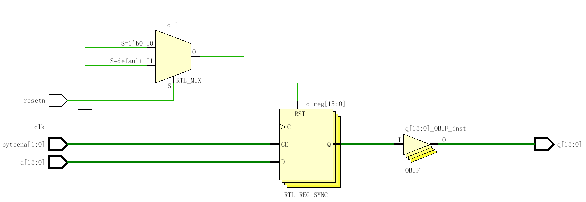

注意此处RTL图，画了4个，只表示是多个叠加并不表示用了4个。实际上要用16个。

- [D Latch](https://hdlbits.01xz.net/wiki/exams/m2014_q4a)
- [DFF](https://hdlbits.01xz.net/wiki/exams/m2014_q4b)
- [DFF](https://hdlbits.01xz.net/wiki/exams/m2014_q4c)
- [DFF+gate](https://hdlbits.01xz.net/wiki/exams/m2014_q4d)
- [Mux and DFF](https://hdlbits.01xz.net/wiki/mt2015_muxdff)
- [Mux and DFF](https://hdlbits.01xz.net/wiki/exams/2014_q4a)
- [DFFs and gates](https://hdlbits.01xz.net/wiki/exams/ece241_2014_q4)

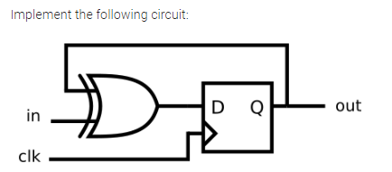

错误代码如下，实际上引入了二级延迟。

```verilog
module m2014_q4d(
    input clk,
    input in, 
    output reg out
    );
	reg temp_XOr;  
	always@(posedge clk) begin
		temp_XOr<=in^out;
		out<=temp_XOr;
	end
    //假设in^out分别为1，2，3，4，5，6
    //假设 第一个上升沿到来时out=1，temp_XOr=2，in^out=3（always所有循环结束后完成赋值，此时temp_XOr=3.out=2）
    //第二个上升沿到来时，out=2,temp_XOr=3,in^out=4
    //第三个上升沿到来时，out=3,temp_XOr=4,in^out=5
	//中间隔了两层。
    //明天写个testbench看下
endmodule

```

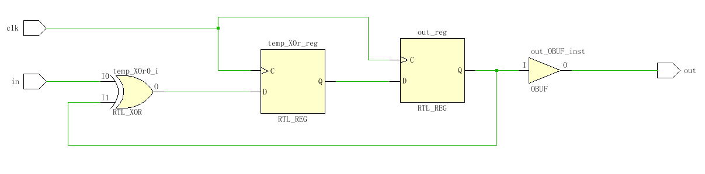

正确代码如下

```verilog
module m2014_q4d(
    input clk,
    input in, 
    output reg out
    );
    always @(posedge clk) begin
        out <= (in ^ out);
    end
endmodule
```

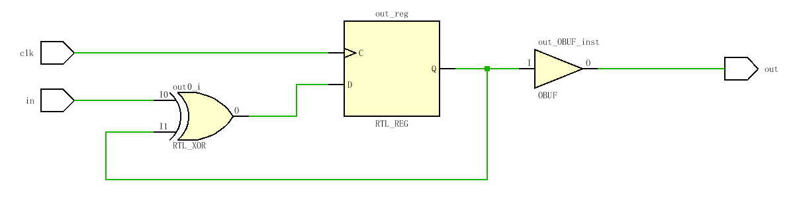


- [Create circuit from truth table](https://hdlbits.01xz.net/wiki/exams/ece241_2013_q7)
- [Detect an edge](https://hdlbits.01xz.net/wiki/edgedetect)
- [Detect both edges](https://hdlbits.01xz.net/wiki/edgedetect2)
- [Edge capture register](https://hdlbits.01xz.net/wiki/edgecapture)
- [Dual-edge triggered flip-flop](https://hdlbits.01xz.net/wiki/dualedge)

#### Counters

- [Four-bit binary counter](https://hdlbits.01xz.net/wiki/count15)
- [Decade counter](https://hdlbits.01xz.net/wiki/count10)
- [Decade counter again](https://hdlbits.01xz.net/wiki/count1to10)
- [Slow decade counter](https://hdlbits.01xz.net/wiki/countslow)
- [Counter 1-12](https://hdlbits.01xz.net/wiki/exams/ece241_2014_q7a)
- [Counter 1000](https://hdlbits.01xz.net/wiki/exams/ece241_2014_q7b)
- [4-digit decimal counter](https://hdlbits.01xz.net/wiki/countbcd)
- [12-hour clock](https://hdlbits.01xz.net/wiki/count_clock)

#### Shift Registers

- [4-bit shift register](https://hdlbits.01xz.net/wiki/shift4)
- [Left/right rotator](https://hdlbits.01xz.net/wiki/rotate100)
- [Left/right arithmetic shift by 1 or 8](https://hdlbits.01xz.net/wiki/shift18)
- [5-bit LFSR](https://hdlbits.01xz.net/wiki/lfsr5)
- [3-bit LFSR](https://hdlbits.01xz.net/wiki/mt2015_lfsr)
- [32-bit LFSR](https://hdlbits.01xz.net/wiki/lfsr32)
- [Shift register](https://hdlbits.01xz.net/wiki/exams/m2014_q4k)
- [Shift register](https://hdlbits.01xz.net/wiki/exams/2014_q4b)
- [3-input LUT](https://hdlbits.01xz.net/wiki/exams/ece241_2013_q12)

#### More Circuits

- Cellular automata
  - [Rule 90](https://hdlbits.01xz.net/wiki/rule90)
  - [Rule 110](https://hdlbits.01xz.net/wiki/rule110)
  - [Conway's Game of Life 16x16](https://hdlbits.01xz.net/wiki/conwaylife)

#### Finite State Machines

- [Simple FSM 1 (asynchronous reset)](https://hdlbits.01xz.net/wiki/fsm1)
- [Simple FSM 1 (synchronous reset)](https://hdlbits.01xz.net/wiki/fsm1s)
- [Simple FSM 2 (asynchronous reset)](https://hdlbits.01xz.net/wiki/fsm2)
- [Simple FSM 2 (synchronous reset)](https://hdlbits.01xz.net/wiki/fsm2s)
- [Simple state transitions 3](https://hdlbits.01xz.net/wiki/fsm3comb)
- [Simple one-hot state transitions 3](https://hdlbits.01xz.net/wiki/fsm3onehot)
- [Simple FSM 3 (asynchronous reset)](https://hdlbits.01xz.net/wiki/fsm3)
- [Simple FSM 3 (synchronous reset)](https://hdlbits.01xz.net/wiki/fsm3s)
- [Design a Moore FSM](https://hdlbits.01xz.net/wiki/exams/ece241_2013_q4)
- [Lemmings 1](https://hdlbits.01xz.net/wiki/lemmings1)
- [Lemmings 2](https://hdlbits.01xz.net/wiki/lemmings2)
- [Lemmings 3](https://hdlbits.01xz.net/wiki/lemmings3)
- [Lemmings 4](https://hdlbits.01xz.net/wiki/lemmings4)
- [One-hot FSM](https://hdlbits.01xz.net/wiki/fsm_onehot)
- [PS/2 packet parser](https://hdlbits.01xz.net/wiki/fsm_ps2)
- [PS/2 packet parser and datapath](https://hdlbits.01xz.net/wiki/fsm_ps2data)
- [Serial receiver](https://hdlbits.01xz.net/wiki/fsm_serial)
- [Serial receiver and datapath](https://hdlbits.01xz.net/wiki/fsm_serialdata)
- [Serial receiver with parity checking](https://hdlbits.01xz.net/wiki/fsm_serialdp)
- [Sequence recognition](https://hdlbits.01xz.net/wiki/fsm_hdlc)

- [Q8: Design a Mealy FSM](https://hdlbits.01xz.net/wiki/exams/ece241_2013_q8)
- [Q5a: Serial two's complementer (Moore FSM)](https://hdlbits.01xz.net/wiki/exams/ece241_2014_q5a)
- [Q5b: Serial two's complementer (Mealy FSM)](https://hdlbits.01xz.net/wiki/exams/ece241_2014_q5b)
- [Q3a: FSM](https://hdlbits.01xz.net/wiki/exams/2014_q3fsm)
- [Q3b: FSM](https://hdlbits.01xz.net/wiki/exams/2014_q3bfsm)
- [Q3c: FSM logic](https://hdlbits.01xz.net/wiki/exams/2014_q3c)
- [Q6b: FSM next-state logic](https://hdlbits.01xz.net/wiki/exams/m2014_q6b)
- [Q6c: FSM one-hot next-state logic](https://hdlbits.01xz.net/wiki/exams/m2014_q6c)
- [Q6: FSM](https://hdlbits.01xz.net/wiki/exams/m2014_q6)
- [Q2a: FSM](https://hdlbits.01xz.net/wiki/exams/2012_q2fsm)
- [Q2b: One-hot FSM equations](https://hdlbits.01xz.net/wiki/exams/2012_q2b)
- [Q2a: FSM](https://hdlbits.01xz.net/wiki/exams/2013_q2afsm)
- [Q2b: Another FSM](https://hdlbits.01xz.net/wiki/exams/2013_q2bfsm)

### Building Larger Circuits

- [Counter with period 1000](https://hdlbits.01xz.net/wiki/exams/review2015_count1k)

- [4-bit shift register and down counter](https://hdlbits.01xz.net/wiki/exams/review2015_shiftcount)
- [FSM: Sequence 1101 recognizer](https://hdlbits.01xz.net/wiki/exams/review2015_fsmseq)
- [FSM: Enable shift register](https://hdlbits.01xz.net/wiki/exams/review2015_fsmshift)
- [FSM: The complete FSM](https://hdlbits.01xz.net/wiki/exams/review2015_fsm)
- [The complete timer](https://hdlbits.01xz.net/wiki/exams/review2015_fancytimer)
- [FSM: One-hot logic equations](https://hdlbits.01xz.net/wiki/exams/review2015_fsmonehot)

## Verification: Reading Simulations

### Finding bugs in code

- [Mux](https://hdlbits.01xz.net/wiki/bugs_mux2)
- [NAND](https://hdlbits.01xz.net/wiki/bugs_nand3)
- [Mux](https://hdlbits.01xz.net/wiki/bugs_mux4)
- [Add/sub](https://hdlbits.01xz.net/wiki/bugs_addsubz)
- [Case statement](https://hdlbits.01xz.net/wiki/bugs_case)

### Build a circuit from a simulation waveform

- [Combinational circuit 1](https://hdlbits.01xz.net/wiki/sim/circuit1)
- [Combinational circuit 2](https://hdlbits.01xz.net/wiki/sim/circuit2)
- [Combinational circuit 3](https://hdlbits.01xz.net/wiki/sim/circuit3)
- [Combinational circuit 4](https://hdlbits.01xz.net/wiki/sim/circuit4)
- [Combinational circuit 5](https://hdlbits.01xz.net/wiki/sim/circuit5)
- [Combinational circuit 6](https://hdlbits.01xz.net/wiki/sim/circuit6)
- [Sequential circuit 7](https://hdlbits.01xz.net/wiki/sim/circuit7)
- [Sequential circuit 8](https://hdlbits.01xz.net/wiki/sim/circuit8)
- [Sequential circuit 9](https://hdlbits.01xz.net/wiki/sim/circuit9)
- [Sequential circuit 10](https://hdlbits.01xz.net/wiki/sim/circuit10)

## Verification: Writing Testbenches

- [Clock](https://hdlbits.01xz.net/wiki/tb/clock)
- [Testbench1](https://hdlbits.01xz.net/wiki/tb/tb1)
- [AND gate](https://hdlbits.01xz.net/wiki/tb/and)
- [Testbench2](https://hdlbits.01xz.net/wiki/tb/tb2)
- [T flip-flop](https://hdlbits.01xz.net/wiki/tb/tff)